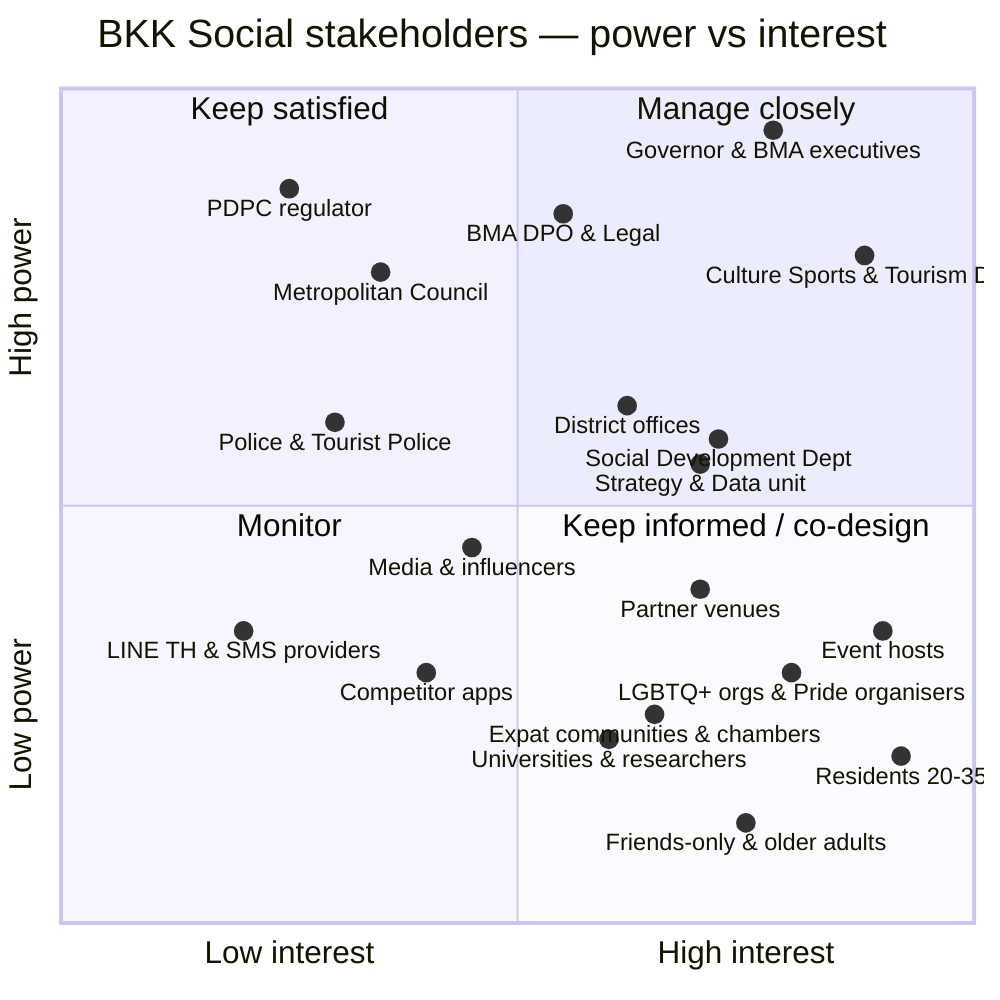

# BKK Social — Strategy Pack: USP, SWOT, Stakeholder Map & Risk Register

*Version 1 · 2026-10-09 · Companion to `bkk-social-prd-v3.md`. Figures marked **[verify]** are background context that should be checked before external use.*

---

## 1. Positioning & USP

### One-liner

> **EN:** Bangkok's own way to make friends. Small groups, real places, no swiping.
> **TH:** เพื่อนใหม่ในเมืองเดียวกัน — กลุ่มเล็ก สถานที่จริง ไม่ต้องปัดหา

### The USP: "The city is the host"

Every other social app is a private company putting strangers in a room. **BKK Social is the city itself**: BMA brings the venue, the activity, the safety and the fairness. Five things together make it hard to copy:

| # | Differentiator | Why competitors can't easily copy it |
|---|---|---|
| 1 | **The city's own places and calendar.** Events run on BMA's parks, skywalks, museums, festivals and the curated **VisitBangkok** routes (Rattanakosin, Yaowarat, Little India, Charoenkrung–Talat Noi, Khlong Bang Luang). | Only BMA can open public spaces, attach events to the official city calendar, and promote them through district offices. |
| 2 | **Fair small-group matching.** A stable-matching clearinghouse seats people so that no two attendees would both rather swap tables (see `matching-experiment.md`). | Competitors use opaque engagement-driven ranking. Ours is explainable and publishes its fairness rule. |
| 3 | **Never rejected, never exposed.** Interest is only revealed when it's mutual, unreturned interest is never shown, there are no cold DMs, and nobody's profile can be browsed. | Swipe apps make money from browsing and from paying to see who liked you. Our model can't be built on that. |
| 4 | **Inclusive by design, not by setting.** Matching is one-sided and gender-neutral, LGBTQ+ users are welcome in every mode, the app is Thai/English, and **friends-only is a first-class choice rather than a fallback**. | Dating apps are built around gendered two-sided markets. Friend apps rarely serve expats and Thai speakers together. |
| 5 | **Your night out improves the city.** Anonymous City Pulse feedback goes directly to BMA, so shade, lighting, sidewalks and transport problems get reported where they happened. | No commercial app has a policy owner on the other end. |

### Competitive matrix

Details of competitors are based on general market knowledge **[verify]** before using this in a pitch.

| | BKK Social | Tinder / Bumble / Hinge | Bumble BFF | Timeleft-style stranger dinners | Meetup / Facebook groups / LINE OpenChat | InterNations (expat) | LGBTQ+ dating apps |
|---|---|---|---|---|---|---|---|
| Primary purpose | Friends + city life; romance optional | Dating | Friends | Friends over dinner | Interest groups | Expat networking | Dating / community |
| Meets in person by design | ✅ every connection starts at an event | ❌ | ❌ | ✅ | ⚠️ varies | ✅ | ❌ |
| Small, structured groups | ✅ 4–6, fairly matched | ❌ | ❌ | ✅ (~6) | ❌ | ❌ | ❌ |
| No browsing or cold messages | ✅ | ❌ | ❌ | ✅ | ❌ | ❌ | ❌ |
| Gender-neutral, LGBTQ+ inclusive in every mode | ✅ | ⚠️ settings | ⚠️ | ✅ | ⚠️ | ⚠️ | ✅ (LGBTQ+ only) |
| Thai + expat in one community | ✅ | ⚠️ | ⚠️ | ⚠️ mostly English | ⚠️ split | ❌ expat-only | ⚠️ |
| Free | ✅ | Freemium | Freemium | Paid per dinner | ✅ / paid | Paid tiers | Freemium |
| Public venues and city calendar | ✅ | ❌ | ❌ | Restaurants | ❌ | Bars/hotels | ❌ |
| Gives back to the city | ✅ City Pulse | ❌ | ❌ | ❌ | ❌ | ❌ | ❌ |

**Positioning statement.** For Bangkok residents (Thai or foreign, any orientation, single or not) who want more people in their life, BKK Social is the city's own social layer. It puts you in small, fairly matched groups at real Bangkok places. Unlike dating and swipe apps, nobody browses you and nobody rejects you, and every outing helps make the city better at bringing people together.

---

## 2. SWOT Matrix

| | **Helpful** | **Harmful** |
|---|---|---|
| **Internal** | **STRENGTHS** • BMA legitimacy, public venues and district reach • VisitBangkok content: routes, attractions, event calendar, ready to use for event formats • Event-first, small-group format makes meeting people less awkward • Explainable stable-matching clearinghouse; fairness can be shown • Mutual consent: no rejection, no cold DMs • Inclusive design: gender-neutral matching, LGBTQ+ safe, Thai/English, friends-first • Privacy by design (3 separate data stores, k ≥ 10 thresholds) • Low-cost PWA; no app-store dependency • City Pulse gives BMA policy data no other app gives it | **WEAKNESSES** • "Government app" may feel uncool, slow or like surveillance • Cold start: needs enough people per event and district • Depends on host quality; no host programme yet • P0 requires a Thai mobile number, which excludes some expats • No in-app chat in P0, which may hurt retention • Moderation capacity and BMA staffing hours • Public-sector procurement and approval speed • Matching weights are untested with real users |
| **External** | **OPPORTUNITIES** • Loneliness is a recognised public-health issue (WHO Commission on Social Connection) **[verify]** • Thai marriage equality in force since Jan 2025 and Bangkok Pride's scale make LGBTQ+-inclusive city programmes timely **[verify]** • Growing long-stay foreign population (e.g. the DTV visa) wants local, non-touristy connection **[verify]** • Bangkok's global "nightlife / coolest street" rankings (VisitBangkok press, 2025–26) give a ready-made story • City festivals as acquisition moments: Bangkok Design Week, Pride, Loy Krathong, Songkran, Art Biennale • Partners: cafés, museums, BACC, universities, employers, embassies, chambers of commerce • Volunteering and city clean-ups double as social events | **THREATS** • Privacy backlash, or "BMA tracks your social life" headlines • A serious safety incident at an event • Harassment or outing of LGBTQ+ users • Romance scams and fake profiles • A change of administration or budget cut after elections • Commercial competitors copy the event format with bigger marketing budgets • Weather and environment: heat, monsoon flooding, PM2.5 seasons cancel outdoor events • Low trust in government digital services • Political polarisation: any civic content can be framed as political |

### TOWS: strategies from the SWOT

| | **Opportunities** | **Threats** |
|---|---|---|
| **Strengths** | **SO (use strengths to seize opportunities)** • Launch at city festivals (Pride, Design Week) using VisitBangkok routes as ready-made event formats • Publish the fairness rule and inclusivity commitments as part of the brand • Co-host LGBTQ+, newcomer and expat-Thai language-exchange events with community partners | **ST (use strengths to blunt threats)** • Lead with privacy: publish the DPIA summary, use no tracking SDKs, and give users an "export my data" option • Use only public or semi-public venues, briefed hosts and check-in by host scan to lower incident risk • Keep the non-political Vibe quiz as the only matching input, which removes the "political profiling" line of attack |
| **Weaknesses** | **WO (fix weaknesses using opportunities)** • Recruit hosts from universities, run clubs and community groups • Add email OTP / LINE Login in P1 to include expats • Use partner venues to solve the cold start: guaranteed minimum group sizes at fixed weekly slots | **WT (minimise both)** • Pilot in 3–5 districts with fixed weekly slots before city-wide launch • Use indoor or covered venues as a backup during monsoon and PM2.5 seasons • Run as a programme with an independent advisory panel so it survives a change of administration |

---

## 3. Stakeholder Map

### Power / interest grid

### Stakeholder register

| Stakeholder | Power | Interest | What they want | Concern | Engagement |
|---|---|---|---|---|---|
| Governor & BMA executives | High | High | A visible, positive social-policy win | Reputational or political risk | Monthly steering; KPI dashboard; pilot go/no-go gates |
| **Culture, Sports & Tourism Dept (runs VisitBangkok)** | High | High | More use of city routes, events and venues | Brand consistency; duplicated work | **Co-owner of events.** Reuse the VisitBangkok calendar, routes and visual language; cross-link both ways |
| BMA DPO & Legal | High | Medium | PDPA compliance | Sensitive data (orientation, location) | DPIA sign-off; privacy-by-design reviews at each phase gate |
| PDPC (national regulator) | High | Low | Lawful processing | Complaints | Keep compliant; publish privacy notice; respond to requests within SLAs |
| Bangkok Metropolitan Council | High | Low–Med | Value for money; constituent benefit | Budget, "dating on taxpayers' money" | Brief on friends-first positioning, cost and social-impact KPIs |
| District offices (50) | Med | Med–High | Local events and participation | Extra workload | District champions; ready-made event kits |
| Social Development Dept | Med | High | Reduce isolation; inclusion | Reaching vulnerable groups | Co-design inclusion programmes and older-adult events |
| Strategy & Data unit | Med | High | City Pulse insight | Data quality | Dashboard access with k-thresholds; data dictionary |
| Police / Tourist Police | Med | Low | Safe public events | Incidents | Escalation contacts; host emergency protocol |
| Partner venues (cafés, museums, BACC, parks) | Low–Med | High | Footfall | No-shows, disruption | Fixed slots; minimum attendance; co-branding |
| Event hosts | Low | Very high | Good, safe events; recognition | Difficult attendees | Briefing, host toolkit, moderator back-up, recognition badges |
| **LGBTQ+ organisations & Pride organisers** | Low–Med | High | Genuinely safe, inclusive spaces | Tokenism; data exposure; harassment | **Co-design** the inclusion features; review safety policy; co-host events |
| **Expat communities, embassies, chambers** | Low | Med–High | Integration; local friendships | Language; Thai-SIM barrier | English onboarding; language-exchange events; P1 email OTP |
| Universities & researchers | Low | Med | Loneliness research; student wellbeing | Research ethics | Data-sharing agreement under ethics review; aggregated only |
| Residents 20–35 (core users) | Low (individually) | Very high | Fun, low-pressure ways to meet people | Awkwardness, safety, cringe | User research, beta cohort, in-app feedback |
| Friends-only users & older adults | Low | High | Company without dating pressure | Being shown romance; tech barriers | Friends-only mode by default; simple UI; daytime events |
| Media & influencers | Med | Med | Stories | — | Launch story built on inclusivity and fairness; creator-hosted events |
| Competitor apps | Low–Med | Low–Med | Market share | — | Monitor; differentiate on public venues and fairness |
| LINE Thailand, SMS providers | Low–Med | Low | Commercial contracts | — | Standard procurement |
| Dev team / SV Cloud | Med | High | Clear specs | Scope creep | P0/P1/P2 phase gates |

---

## 4. Risk Register

**Scoring:** Likelihood (L) and Impact (I) are each rated 1–5. Score = L × I. **Red ≥ 15**, Amber 8–14, Green ≤ 7.

| ID | Category | Risk | L | I | Score | Mitigation | Early warning | Owner |
|---|---|---|---|---|---|---|---|---|
| R1 | Privacy / Legal | Leak or misuse of sensitive data, including gender identity, orientation-related "open to" settings, relationship status and attendance | 2 | 5 | **10** | 3 separate stores; romance fields optional and encrypted; staff can never see them (role matrix); DPIA; pen-test before launch | Access-log anomalies | DPO |
| R2 | Safety | Harassment or assault linked to an event or a connection | 3 | 5 | **15 🔴** | Public venues only; briefed hosts; host-scan check-in; report/block; 1h response for critical reports; no exact locations shared | Report rate > 1 per 100 attendees | Moderation lead |
| R3 | Inclusion / Safety | LGBTQ+ users outed or targeted | 2 | 5 | **10** | Identity never shown publicly; romance layer opt-in and private; queer-safe event tag only with partner-vetted hosts; zero-tolerance policy | Discrimination reports | Moderation lead + LGBTQ+ partner |
| R4 | Reputational / Political | Framed as "BMA surveillance" or "political profiling" | 3 | 4 | **12** | Non-political Vibe quiz only; City Pulse limited to service questions; publish data practices; no third-party trackers | Press or social sentiment | Comms |
| R5 | Reputational | Framed as a "taxpayer-funded dating app" | 3 | 3 | 9 | Friends-first positioning; romance hidden unless opted in; report social-impact KPIs | Council questions | Programme owner |
| R6 | Adoption | Cold start: groups too small or too few events, so users churn | 4 | 4 | **16 🔴** | Pilot in 3–5 districts; fixed weekly slots; festival launches; partner-guaranteed attendance; waitlists create scarcity | RSVP fill rate < 60% | Product |
| R7 | Adoption | No-shows ruin small groups | 4 | 3 | 12 | Strike policy; reminders; overbook by 10%; groups formed only from people who checked in | No-show > 25% | Product |
| R8 | Inclusion | Expats excluded by Thai-SIM OTP or Thai-only content | 4 | 3 | 12 | Thai/English from P0; email OTP / LINE Login in P1; English-friendly events | Share of English-locale sign-ups | Product |
| R9 | Matching / Algorithm | Echo chambers: groups split by language, age or vibe | 3 | 3 | 9 | Novelty bonus; language "bridge" rule (one shared speaker is enough); diversity metrics in dashboard; host can override | Group-diversity index trending down | Data lead |
| R10 | Matching / Algorithm | Users find matches unfair or opaque | 2 | 3 | 6 | Exchange-stable groups; publish the plain-language rule; post-event "how was your group?" rating | Group rating < 3.5/5 | Data lead |
| R11 | Matching / Algorithm | No stable 1:1 matching exists (≈3–10% of rounds in simulation) | 3 | 1 | 3 | Automatic greedy fallback, which still leaves very few blocking pairs | Fallback rate | Engineering |
| R12 | Fraud | Romance scams, fake profiles, commercial spam | 3 | 4 | 12 | OTP plus phone uniqueness; contact exchange only after mutual consent at a real event; scam-report category; rate limits | Scam reports | Moderation lead |
| R13 | Operational | Moderation backlog or after-hours gaps | 3 | 4 | 12 | Staffed rota during event hours; host escalation; automatic triage of keywords | Queue age > 24h | Ops |
| R14 | Operational | Poor host quality | 3 | 3 | 9 | Host briefing and toolkit; post-event host rating; remove low-rated hosts | Host rating < 4/5 | Community lead |
| R15 | External | Heat, monsoon flooding or PM2.5 cancels events | 4 | 2 | 8 | Indoor and covered backup venues; a weather and air-quality rule in the event template | AQI / rain forecast | Events |
| R16 | Political / Funding | Budget cut or change of administration ends the programme | 2 | 5 | **10** | Cross-party framing (loneliness, safety, tourism); advisory panel; open-source the code; low run cost | Budget cycle | Programme owner |
| R17 | Technical | SMS OTP outage or cost spike | 2 | 3 | 6 | Provider abstraction; LINE Login fallback (P1); rate limits | OTP failure rate | Engineering |
| R18 | Technical | Security breach of the web app | 2 | 5 | **10** | OWASP review; dependency scanning; least-privilege database roles; secrets managed by platform | Error spikes / WAF alerts | Engineering |
| R19 | Accessibility | Excludes disabled or older users | 3 | 3 | 9 | WCAG 2.1 AA; venue accessibility info; step-free tag; large-text mode | Accessibility complaints | Product |
| R20 | Legal | Romance gate misused (people lying about being single) | 3 | 2 | 6 | Code of conduct; report reason; romance never auto-matched | Reports | Moderation lead |
| R21 | Data quality | City Pulse answers biased toward the young, online, central-district population | 4 | 2 | 8 | Weighting by district and age; state the limits in reports; offline intercepts at events | Sample skew | Data lead |

### Risk heat map

| Likelihood ↓ / Impact → | 1 Minimal | 2 Minor | 3 Moderate | 4 Major | 5 Severe |
|---|---|---|---|---|---|
| **5 Almost certain** | | | | | |
| **4 Likely** | | R15, R21 | R7, R8 | **R6** | |
| **3 Possible** | R11 | R20 | R9, R14, R19, R5 | R4, R12, R13 | **R2** |
| **2 Unlikely** | | | R10, R17 | | R1, R3, R16, R18 |
| **1 Rare** | | | | | |

**Top 5 to manage:**
1. **R6 Cold start.** Without enough people at each event, nothing else matters.
2. **R2 Safety incident.**
3. **R4 Surveillance or political framing.**
4. **R12 Scams.**
5. **R1 / R3 Sensitive-data leak or outing.**

---

## 5. How VisitBangkok feeds BKK Social

`visit.bangkok.go.th` is run by BMA's Culture, Sports & Tourism Department. It is the natural content partner:

| VisitBangkok asset | Use in BKK Social |
|---|---|
| **Recommended routes** (Rattanakosin classic, 9-temples, Little India, Charoenkrung–Talat Noi creative route, Khlong Bang Luang artists' house) | Ready-made **"City Quest" small-group events**. Each route is a 2–3 hour walk with a host and 4–6-person groups. |
| **Place directory** (categories: photo spots, food, history & culture, walking streets, art, cafés, rituals; "suitable for" tags; opening days) | Venue picker in the admin event form; tags map to interest categories; place names seed the procedurally generated quiz scenes. |
| **Event & festival calendar** | BKK Social "go together" events attached to official festivals, such as a meet-up group for a Loy Krathong or Design Week evening. |
| **Visual and tone language** (Thai-first, warm, place photography) | Shared design cues so BKK Social reads as part of the BMA family without looking like a government form. |
| **Tourist-information articles** (transport, Bangkok Made souvenirs) | "New to Bangkok" onboarding cards for expats and people from other provinces. |
